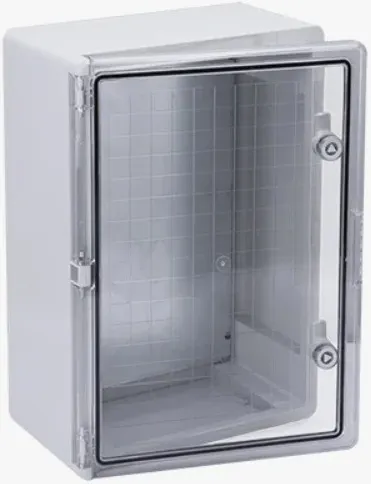
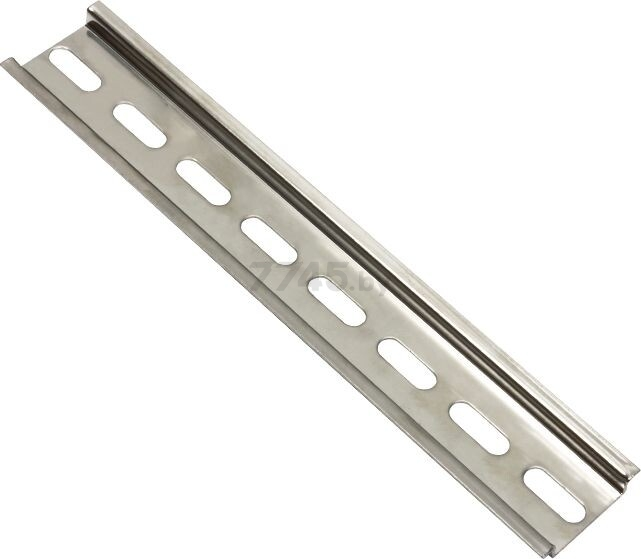
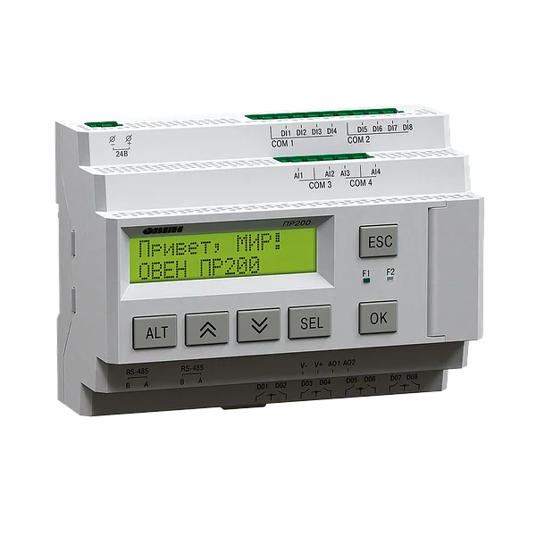
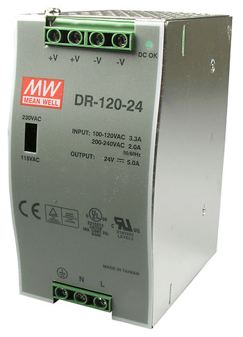
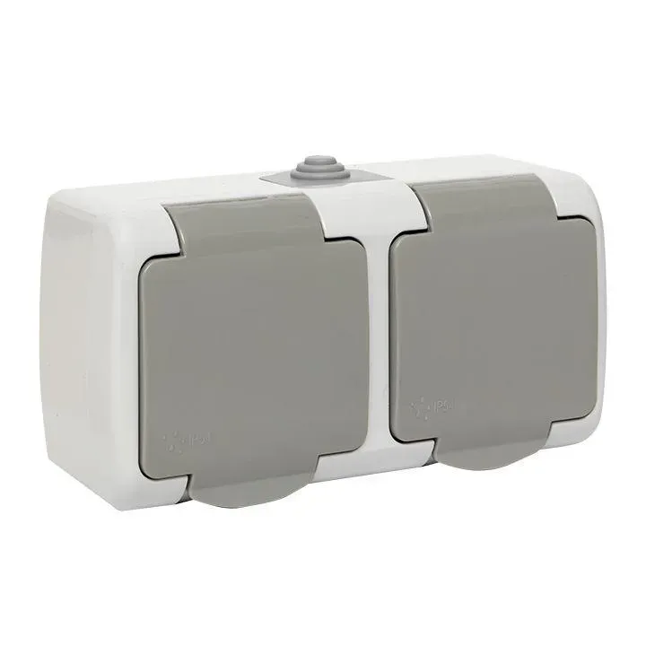
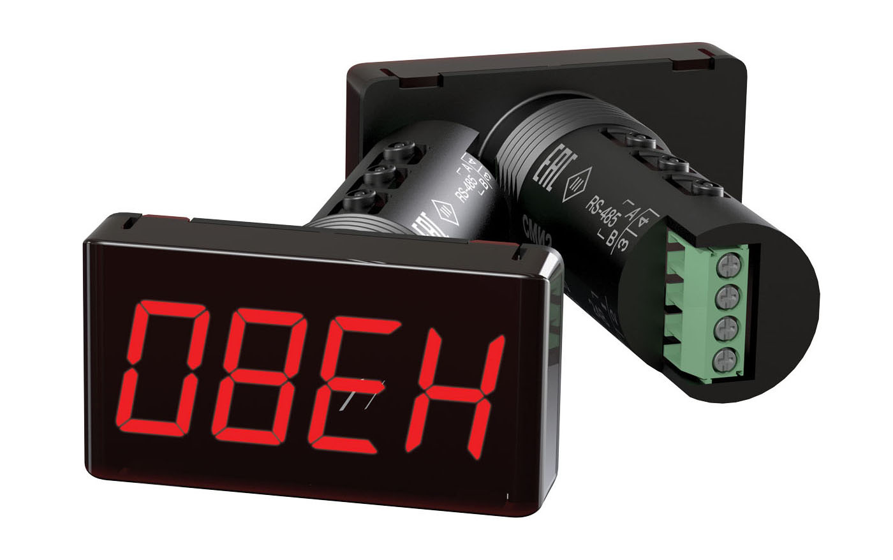
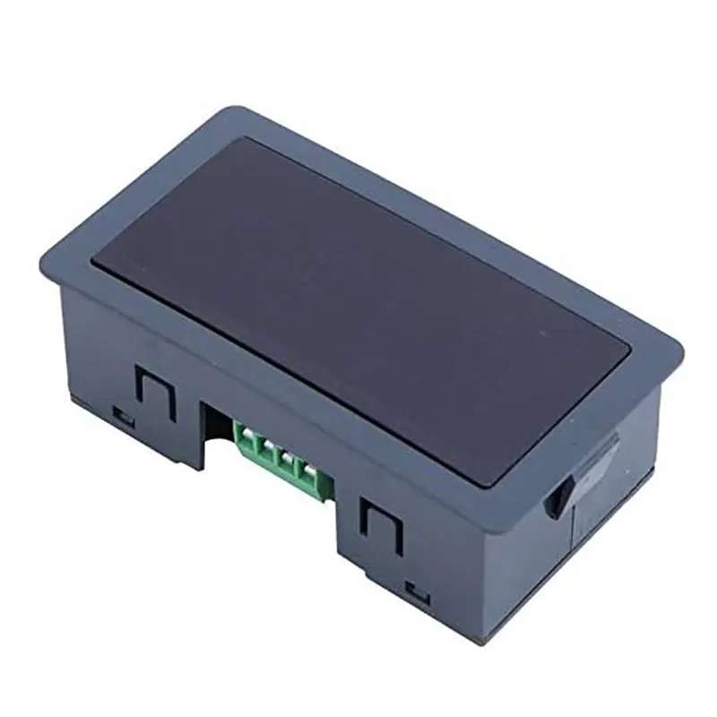
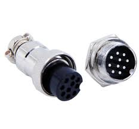

# инструкция по настройке ПК

этот раздел ещё не заполнен

# инструкция по сборке ящика

## выбор ящика

этот раздел ещё не заполнен

## электрическая комутация для ящика счётной станции

на схемах выше приведена схема комутации основных узлов счётной станции, ниже предстанлены сами узлы для примерного понимания что они из себя представляют

### корпус ящика

моннтаж ПР200 блока питания на 24в и преобразователя интерфейсов происходит на DIN рейку длинной 260 мм

ниже представлено фото ПР200

они бывают разных модификаций, нам интересна та что с питанием 24в и двумя интерфейсами RS485

блок питания выглядит примерно так

можно рассматривать менее мощные (5 ампер это с огромным запасом) ключевым аспектом для выбора будут габариты, однако если не выбирать не больше 3 ампер, то должны влезть все

преобразователь АС4 (фото ниже)

может быть разных ревизий с разными микросхемами преобразования, соответственно разными драйверами, поэтому актуальный драйвер с сайта ОВЕН может не подойти.

розетки которые используются и обычно в наличии:

индикатор СМИ2 (рендер ниже)

используется по причине наличия такового, в виду того что имеет недостатки (цена, плохие зажимные контакты) планируется переход на "Светодиодный индикатор последовательного порта RS485 4-разрядный 0,56-дюймовый дисплей MODBUS-RTU подходит совместим с оборудования автоматизации" с озона(фото ниже)

индикатор крепится на дверце ящика, для более контрастного отображения линёру.

кнопки так же устанавливаются на дверь, на данный момент установлены временные, но же планируется замена на "SW2C-11" или аналог (фото ниже)

разъём для комутации с датчиками GX16 10 pin (фото ниже)

распайка производится согласно нумерации на схеме коммутации

блок питания моноблока просто акуратно укладывается внизу ящика.

Резистор допускает отклонения от номинала ±70%

<video src="IMG_0356.MOV"></video>